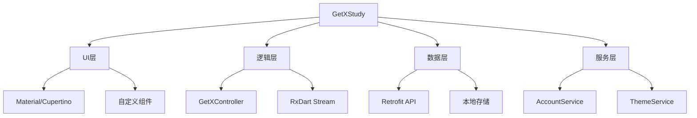
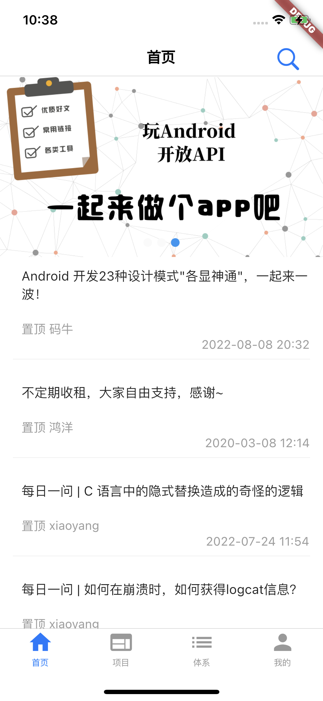
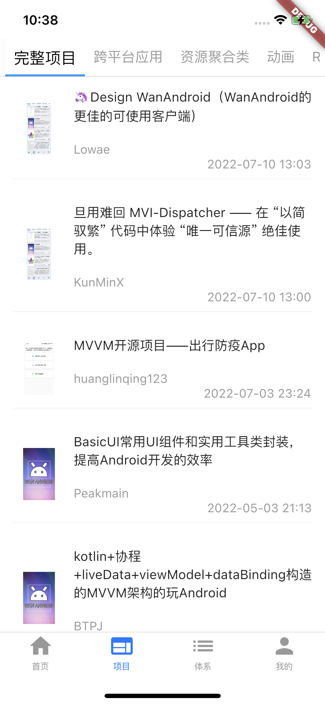
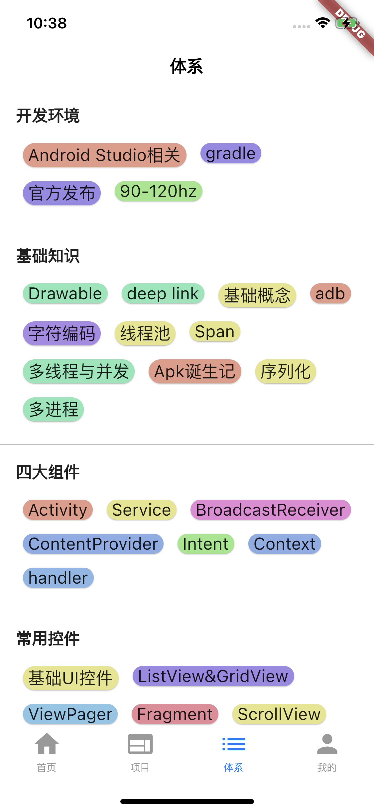
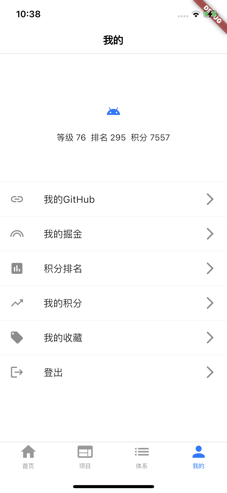
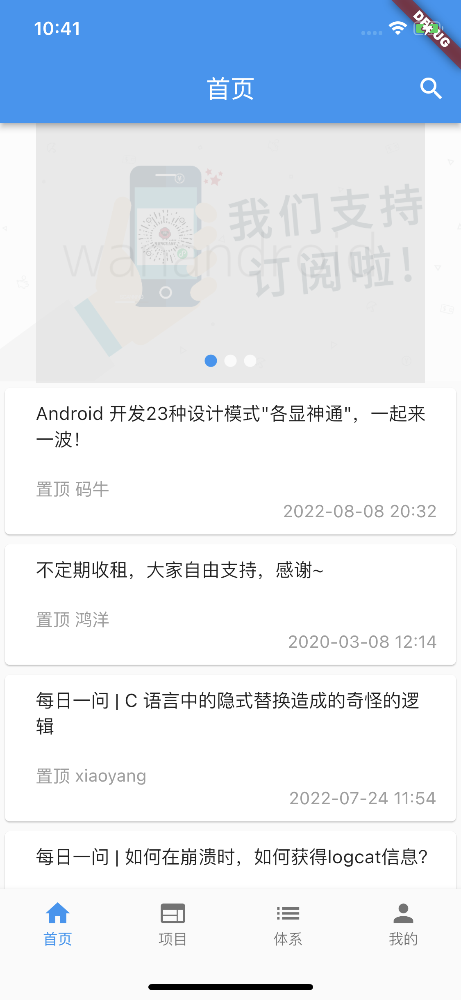
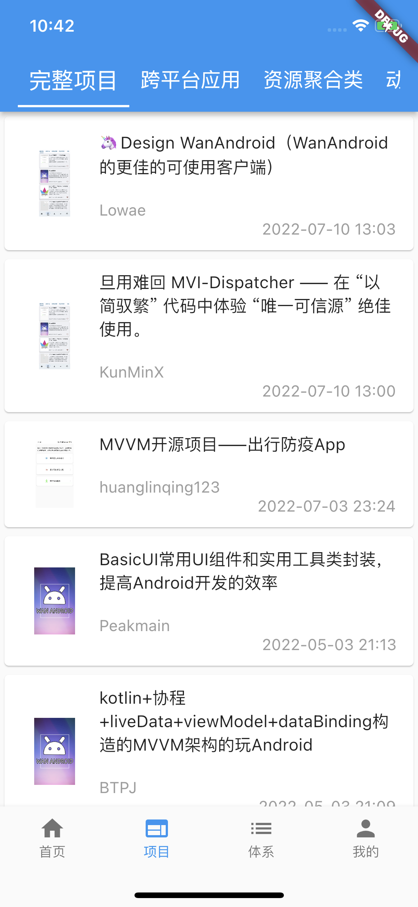
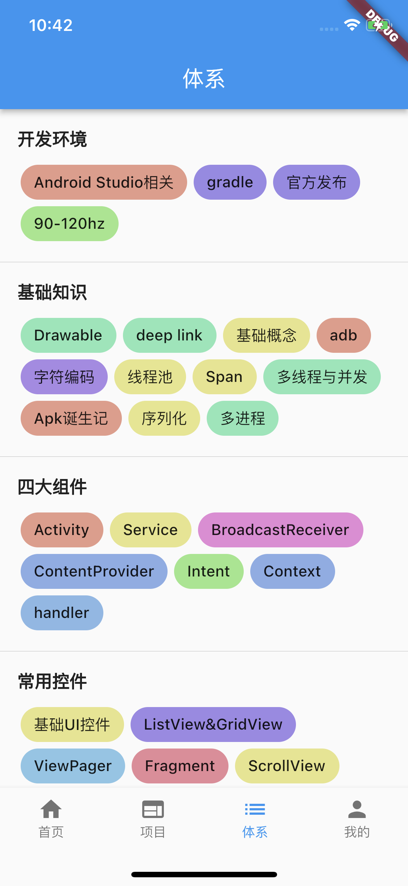
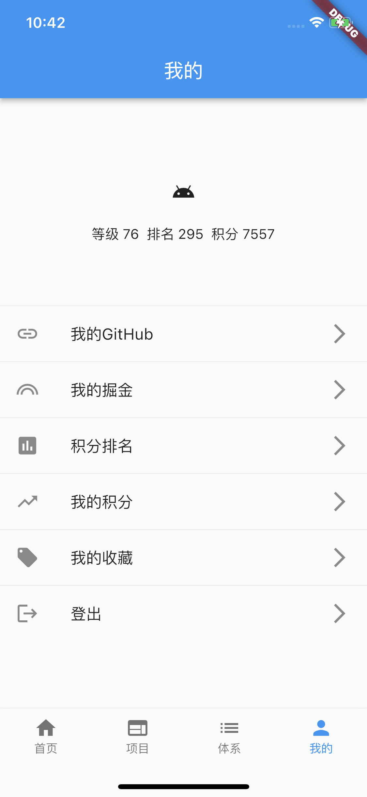

# GetXStudy - WanAndroid 客户端

<div align="center">


基于 GetX 框架构建的 Flutter WanAndroid 客户端，采用响应式编程架构，展示现代 Flutter 开发最佳实践。

[功能特性](#-功能特性) • [快速开始](#-快速开始) • [项目架构](#-项目架构) • [完整文档](#-项目文档)

</div>

---

## 📖 项目简介

本项目是一个基于 [WanAndroid 开放 API](https://www.wanandroid.com/) 的 Flutter 客户端应用，旨在展示如何使用 **GetX** 框架构建生产级别的移动应用。

### 核心特点

- 🏗️ **GetX 全家桶**：状态管理、路由管理、依赖注入一体化解决方案
- 📱 **双风格支持**：Material Design & Cupertino 两种 UI 风格
- 🔄 **响应式编程**：基于 RxDart 的流式数据处理
- 🛠️ **Retrofit 风格 API**：类型安全的网络请求层
- 🎨 **微交互优化**：流畅的动画过渡和用户交互体验

---

## ✨ 功能特性

### 核心功能

| 模块 | 功能描述 |
|:-----|:---------|
| 🏠 **首页** | 文章列表、Banner 轮播、热门搜索 |
| 📁 **项目** | 项目分类、Tab 切换、分页加载 |
| 🌳 **体系** | 知识体系树形导航 |
| 👤 **我的** | 登录注册、收藏管理、积分排行 |

### 交互体验

- ✅ 下拉刷新 / 上拉加载更多
- ✅ 搜索功能（热门搜索关键词、实时搜索）
- ✅ 收藏/取消收藏文章
- ✅ WebView 文章详情页
- ✅ 分享功能
- ✅ 侧滑删除操作

---

## 🚀 快速开始

### 环境要求

```yaml
Flutter SDK: >=3.0.0
Dart SDK:   >=3.0.0 <4.0.0
```

### 安装步骤

```bash
# 1. 克隆项目
git clone https://github.com/seasonZhu/GetXStudy.git
cd GetXStudy

# 2. 安装依赖
flutter pub get

# 3. 生成代码（Retrofit、JsonSerializable）
flutter pub run build_runner build --delete-conflicting-outputs

# 4. 运行项目
# iOS
flutter run

# Android
flutter run
```

### 项目配置

#### 生成启动屏

```bash
flutter pub run flutter_native_splash:create
```

#### 代码格式化

```bash
# 格式化所有代码
dart format .

# 检查格式问题
dart format --output=none --set-exit-if-changed .
```

---

## 🏗️ 项目架构

### 技术栈


```mermaid
graph TB
    A[GetXStudy] --> B[UI层]
    A --> C[逻辑层]
    A --> D[数据层]
    A --> E[服务层]

    B --> B1[Material/Cupertino]
    B --> B2[自定义组件]

    C --> C1[GetXController]
    C --> C2[RxDart Stream]

    D --> D1[Retrofit API]
    D --> D2[本地存储]

    E --> E1[AccountService]
    E --> E2[ThemeService]
```

### 目录结构

```
lib/
├── app_service/          # 应用服务（账户、主题）
├── base/                 # 基类和接口定义
├── entity/               # 数据实体
├── enum/                 # 枚举定义
├── generated/            # 自动生成的代码
├── http_client/          # HTTP 客户端
├── http_util/            # HTTP 工具类
├── pages/                # 页面
│   ├── home/            # 首页模块
│   ├── tree/            # 体系模块
│   ├── my/              # 我的模块
│   ├── main/            # 主页
│   ├── web/             # WebView
│   ├── coin_rank/       # 排行榜
│   └── common/          # 公共组件
├── resource/             # 资源常量
├── routes/               # 路由配置
├── util/                 # 工具类
└── widget/               # 公共 Widget
```

### 设计模式

- **MVVM 架构**：View ↔ Controller ↔ Model
- **Repository 模式**：数据层抽象
- **Service Locator**：依赖注入
- **Observer 模式**：响应式状态管理

---

## 📚 项目文档

完整的文档已迁移至 [docs/](./docs/) 目录：

| 文档 | 说明 |
|:-----|:------|
| [📖 文档索引](./docs/INDEX.md) | 所有文档的快速导航入口 |
| [🏗️ 架构说明](./docs/ARCHITECTURE.md) | 项目架构、设计模式、目录结构详解 |
| [🔌 API 文档](./docs/API_DOCUMENTATION.md) | 网络请求接口、数据模型、错误处理 |
| [✨ 微交互效果指南](./docs/MICRO_INTERACTIONS_GUIDE.md) | 按钮动画、页面过渡、列表动画 |
| [🎨 常量管理指南](./docs/CONSTANTS_MANAGEMENT.md) | 资源配置、字符串、颜色管理 |
| [🚀 快速开始](./docs/CONSTANTS_QUICK_START.md) | 5分钟快速上手常量管理 |

### 文档快速链接

- **架构相关**: [架构设计](./docs/ARCHITECTURE.md) | [设计模式](./docs/ARCHITECTURE.md#设计模式) | [状态管理](./docs/ARCHITECTURE.md#状态管理)
- **API 相关**: [接口列表](./docs/API_DOCUMENTATION.md#api-端点) | [数据模型](./docs/API_DOCUMENTATION.md#数据模型) | [错误处理](./docs/API_DOCUMENTATION.md#错误处理)
- **开发指南**: [最佳实践](./docs/ARCHITECTURE.md#最佳实践) | [性能优化](./docs/ARCHITECTURE.md#性能优化) | [安全建议](./docs/ARCHITECTURE.md#安全建议)

---

## 📸 界面预览

### Cupertino 风格

<table>
  <tr>
    <td></td>
    <td></td>
    <td></td>
    <td></td>
  </tr>
</table>

### Material 风格

<table>
  <tr>
    <td></td>
    <td></td>
    <td></td>
    <td></td>
  </tr>
</table>

---

## 📦 依赖说明

### 核心依赖

```yaml
# 框架核心
dependencies:
  # GetX 框架：状态管理、路由、依赖注入
  get: ^4.6.6

  # 网络请求
  dio: ^5.7.0
  retrofit: '>=4.0.0 <5.0.0'
  dio_cache_interceptor: ^3.5.0
  pretty_dio_logger: ^1.3.1
  native_dio_adapter: ^1.0.0+1

  # 响应式编程
  rxdart: ^0.28.0

  # 本地存储
  shared_preferences: ^2.3.3
  flutter_secure_storage: ^9.2.2

  # UI 组件
  cached_network_image: ^3.4.1
  flutter_easyloading: ^3.0.5
  pull_to_refresh: ^2.0.0
  card_swiper: ^3.0.1
  flutter_slidable: ^4.0.3
  webview_flutter: ^4.2.2
  marqueer: ^2.3.1

  # 工具库
  lpinyin: ^2.0.3
  share_plus: ^12.0.1
  image_picker: ^1.0.1
  url_launcher: ^6.1.5
  path_provider: ^2.0.11
  event_bus: ^2.0.0
  permission_handler: ^12.0.1
  logger: ^2.6.2
  device_info_plus: ^12.3.0
  package_info_plus: ^8.3.0
  flutter_native_splash: ^2.4.7

  # 代码生成
  json_annotation: ^4.8.1

dev_dependencies:
  # 代码生成工具
  retrofit_generator: ^10.2.1
  json_serializable: ^6.6.2
  build_runner: '>=2.3.0 <4.0.0'

  # 代码质量
  flutter_lints: ^6.0.0
  dependency_validator: ^5.0.3
```

---

## 💡 GetX 使用心得

> 摘自作者在 Flutter 和响应式编程方面的学习经验

在 Flutter 状态管理的学习路径上，我经历了从 `StatefulWidget` + `setState` 到 `Provider`，再到 `Bloc`/`Redux` 的过程。虽然 `Provider` 设计优秀，但 `Bloc` 和 `Redux` 在我看来确实过于复杂。

**GetX** 的出现很好地平衡了开发效率和代码质量：

### ✅ 优势

- 摆脱 `context` 依赖，`Get.put` / `Get.find` 召之即来挥之即去
- 响应式状态管理与 UI 自动绑定
- 内置路由、依赖注入、工具类，全家桶解决方案
- 对有 RxSwift/Vue 经验的开发者非常友好

### ⚠️ 注意事项

- `GetXController` 的生命周期管理需要谨慎（创建与销毁时机）
- 不太符合 Flutter 传统自顶而下的管理思路
- 需要理解背后的 Map 存储机制

### 📚 学习建议

对于 Flutter 初学者，我建议的学习路径是：

```
StatefulWidget → Provider → GetX
```

这样循序渐进，才能真正理解各框架的设计理念和价值。**所谓一通百通**，我也通过 RxSwift 与 Vue 编写了 wanandroid 客户端，欢迎大家一起学习交流。

---

## 🤝 贡献指南

欢迎提交 Issue 和 Pull Request！

1. Fork 本仓库
2. 创建特性分支 (`git checkout -b feature/AmazingFeature`)
3. 提交更改 (`git commit -m 'Add some AmazingFeature'`)
4. 推送到分支 (`git push origin feature/AmazingFeature`)
5. 提交 Pull Request

---

## 📜 更新日志

### 2025年12月26日

- 项目架构优化和代码重构

### 2023年8月15日

- 模块整合优化：项目/公众号模块统一复用 Tree 模块
- StateView 组件简化合并
- Page 层从 StatefulWidget 迁移到 StatelessWidget
- 引入 Dart 版本 Retrofit
- MyController 业务拆分优化
- AccountManager 抽取为 AccountService
- Mixin 使用优化

---

## 🔗 相关项目

| [](https://github.com/seasonZhu/RxStudy) | [](https://github.com/seasonZhu/GetXStudy) | [](https://github.com/seasonZhu/HarmonyStudy) | [](https://github.com/seasonZhu/UniAppPlayAndroid) |
|:---:|:---:|:---:|:---:|
| [Swift 版](https://github.com/seasonZhu/RxStudy) | [Flutter 版](https://github.com/seasonZhu/GetXStudy) | [HarmonyOS 版](https://github.com/seasonZhu/HarmonyStudy) | [uni-app 版](https://github.com/seasonZhu/UniAppPlayAndroid) |

---

## 👨‍💻 作者

**seasonZhu**

- 掘金: [seasonZhu](https://juejin.cn/user/4353721778057997)
- GitHub: [@seasonZhu](https://github.com/seasonZhu)

---

## 📄 许可证

本项目采用 [MIT](LICENSE) 许可证。

---

<div align="center">

**如果这个项目对你有帮助，请给一个 ⭐️ 支持一下！**

Made with ❤️ by seasonZhu

</div>
